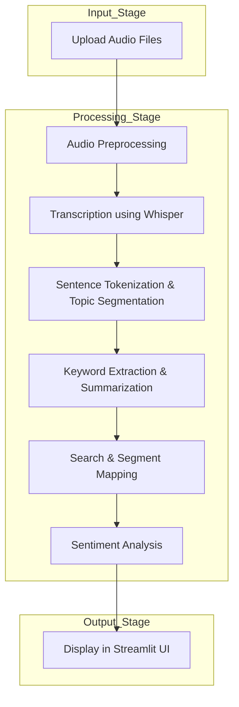

# Automated Medical Podcast Transcription & Topic Segmentation

An AI-powered system that automatically transcribes medical podcast audio, segments conversations into meaningful medical topics, and generates **keywords, summaries, sentiment analysis**, and searchable transcripts through an interactive Streamlit web application.

---

## Project Overview

Medical podcasts contain valuable discussions about diseases, treatments, clinical practices, and research advancements. However, their long duration makes it difficult to quickly access relevant information.

This project addresses that challenge by:

- Converting podcast audio into accurate text using OpenAI Whisper  
- Segmenting transcripts into topic-based medical sections  
- Extracting keywords and summaries  
- Performing **medical-specific sentiment analysis**  
- Providing a searchable and user-friendly Streamlit interface  

---

## Key Features

### Automatic Audio Transcription
- High-quality speech-to-text using OpenAI Whisper  
- Supports long medical podcast audio files  

### Topic Segmentation
- Sentence-level segmentation using NLTK  
- TF-IDF based keyword extraction  
- Segment numbering for easy reference  

### Keyword Extraction & Summarization
- Medical-topic-focused keyword extraction  
- Concise summaries for each segment  


### Global Transcript Search
- Search keywords across the entire transcript  
- Displays matching segment numbers

### Sentiment Analysis
- Analyzes sentiment (positive, neutral, negative) for each segment  
- Medical-specific dictionary or model-based analysis  
- Visual representation in Streamlit UI (charts)  

### Interactive Streamlit UI
- Full transcript visibility  
- Clear layout with color-enhanced sections  
- Easy navigation between segments  

### Offline NLTK Support
- Works offline once NLTK data is downloaded  

---

## Tech Stack

| Component           | Technology                        |
|--------------------|----------------------------------|
| Language           | Python                            |
| UI Framework       | Streamlit                         |
| Speech-to-Text     | OpenAI Whisper                    |
| NLP                | NLTK                              |
| Feature Extraction | Scikit-learn (TF-IDF)             |
| Audio Processing   | Pydub                             |
| Visualization      | Matplotlib / Streamlit Charts     |
| Sentiment Analysis | Custom medical sentiment module   |

---
##  Project Structure

```text
Automated-Medical-Podcast-Transcription
├── audio_raw/                          # Original uploaded podcast audio files
├── audio_processed/                    # Preprocessed / cleaned audio files
├── docs/                               # Project documentation and references
├── logs/
│   └── app.log                         # Application logs and error tracking
├── notebooks/                          # Jupyter notebooks for experimentation
├── segments_keywordExtract_summary/   # Topic segments, keywords & summaries
├── src/                                # Core source code
│   ├── app.py                          # Main Streamlit application
│   ├── preprocessing.py                # Audio preprocessing logic
│   ├── transcription.py                # Whisper-based transcription module
│   └── segmentation_keywordExtract_Summary.py
│                                      # Topic segmentation, keyword extraction,
│                                      # and summary generation
├── temp_audio/                         # Temporary audio chunks during processing
├── tests/                              # Test cases and validation scripts
├── transcripts/                        # Final generated transcripts
├── requirements.txt                    # Python dependencies
└── README.md                           # Project documentation


```
# Workflow



---

## Workflow

1. Upload podcast audio  
2. Preprocess audio (noise reduction, chunking)  
3. Transcribe audio using OpenAI Whisper  
4. Segment transcript into topics  
5. Extract keywords and generate summaries  
6. Perform **medical sentiment analysis**  
7. Visualize results and enable transcript search via Streamlit UI  

---

## Output

- Full medical podcast transcript  
- Topic-wise segmented content  
- Extracted keywords and summaries  
- **Segment-level sentiment analysis** (positive, neutral, negative)  
- Search audio segments containing particular words  

---

## Use Cases

- Medical students reviewing podcast lectures  
- Researchers analyzing expert discussions  
- Healthcare professionals summarizing long talks  
- **Analyzing sentiment trends in medical discussions**  
- Academic projects in NLP & speech processing  

---

## Limitations

- Transcription speed depends on system performance  
- Topic segmentation is statistical (TF-IDF based)  
- Sentiment analysis uses a dictionary-based approach and may not capture subtle medical context  

---

## Future Enhancements

- Transformer-based topic modeling (BERTopic)  
- Speaker diarization  
- Multilingual medical podcast support  
- PDF / DOCX export of summaries  
- Medical Named Entity Recognition (NER)  
- **Advanced sentiment analysis using transformer-based models** for better context understanding  

---

## License

This project is licensed under the MIT License.


